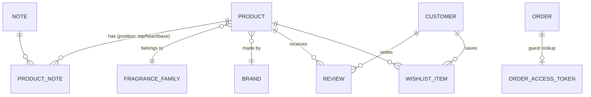

# Data Model

Medusa v2 ships the commerce core (products, variants, carts, orders, customers, payments, fulfillment, regions). This doc lists **what we add**: fragrance-specific catalog structure, reviews, wishlists, and guest-access tokens. Additions are Medusa modules with their own tables, linked to core entities via Medusa's module links.

## What Medusa already gives us (no work)

`product`, `product_variant` (size/concentration variants), `product_category`, `product_collection`, `product_tag`, `cart`, `order`, `customer`, `customer_address`, `payment`, `region`, `shipping_option`, `inventory_item` + stock levels.

## Fragrance-specific extensions

### `brand`

Medusa has no first-class brand; collections are too weak (a product needs exactly one brand with its own metadata).

| Column | Type | Notes |
|---|---|---|
| `id` | pk | |
| `name`, `slug` | text, unique slug | slug drives `/brands/[slug]` |
| `logo_url` | text | Cloudinary `brands/{slug}/logo.png` |
| `description` | text | brand-page intro, SEO copy |
| `country`, `founded_year` | text, int | brand-page facts |
| `is_niche` | bool | facet: niche vs designer |

Link: `product ↔ brand` (many-to-one).

### `note` and `product_note`

Notes are the core browse/search vocabulary ("vanilla", "bergamot", "oud").

| `note` | | `product_note` | |
|---|---|---|---|
| `id`, `name`, `slug` | unique | `product_id`, `note_id` | composite pk |
| `category` | citrus/floral/woody/… | `position` | enum `top` / `heart` / `base` |

### `fragrance_family`

Flat lookup: floral, oriental/amber, woody, fresh, fougère, chypre, gourmand. `product.family_id` many-to-one. Drives the primary PLP facet and same-family recommendation fallback.

### Product attributes (Medusa product metadata or module fields)

- `concentration` — enum: EDT / EDP / Parfum / EDC / extrait (also a variant option where one fragrance sells in multiple concentrations)
- `gender` — enum: masculine / feminine / unisex (facet)
- `longevity_hint`, `sillage_hint` — optional editorial scores 1–5
- `popularity_score` — float, recomputed nightly from 30-day order counts; Algolia custom ranking input

Variants use Medusa options: **Size** (e.g. 50ml/100ml) × **Concentration** when applicable. Samples/decants are variants (`size: 2ml sample`), not separate products.

### `review`

| Column | Type | Notes |
|---|---|---|
| `id` | pk | |
| `product_id`, `customer_id` | fk | `customer_id` nullable never — reviews require an account |
| `order_id` | fk nullable | set ⇒ "Verified purchase" badge |
| `rating` | int 1–5 | |
| `title`, `body` | text | |
| `status` | enum `pending` / `approved` / `rejected` | default `pending`; admin moderates |
| `created_at` | timestamptz | |

Unique on (`product_id`, `customer_id`). Aggregates (`avg_rating`, `review_count`) denormalized onto the product record on approval — read on every PDP/PLP card, so don't compute per request.

### `wishlist_item`

| Column | Type | Notes |
|---|---|---|
| `id`, `customer_id`, `product_id` | | unique (`customer_id`, `product_id`) |
| `created_at` | | |

Guest wishlists live in Redis only ([13-upstash-redis](../01-prerequisites/13-upstash-redis.md)) and merge into this table on sign-in ([19-wishlist TRD](../03-pages/19-wishlist.md)).

### `order_access_token`

Tokenized guest access to order status ([11-order-status TRD](../03-pages/11-order-status-tracking.md)).

| Column | Type | Notes |
|---|---|---|
| `id`, `order_id` | | one active token per order |
| `token_hash` | text | store SHA-256, never the raw token; raw token appears only in emailed links |
| `expires_at` | timestamptz | order date + 90 days |

### `restock_subscription`

`product_id` (or variant), `email`, `created_at`, `notified_at nullable`. Written from the PDP out-of-stock state; a subscriber on inventory-restock events sends the back-in-stock email and hands the profile to Klaviyo.

## Where each surface reads from

| Surface | Source |
|---|---|
| PLP/PDP catalog data | Medusa Store API (ISR-cached) |
| Search, PLP facets | Algolia (fed from these tables — record shape in [search doc](../04-cross-cutting/search-and-recommendations.md)) |
| Guides/policies | Sanity (content only; product references resolve against Medusa by handle) |
| Cart/checkout/orders | Medusa, always dynamic |

## Seed & migration plan

1. Migrations for the extension modules land with their feature phase (brands/notes/families in Phase 1; reviews/wishlist in Phase 2/3 per [roadmap](../05-roadmap.md)).
2. Seed script: ~10 brands, ~60 notes, 7 families, ~30 products with real note pyramids — enough for search/recommendation development to feel real.
