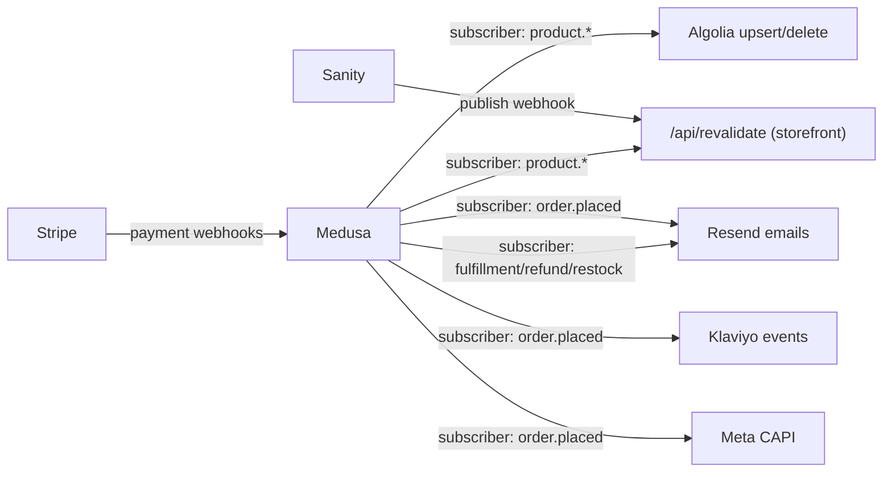

# Integration Map

Every webhook and event fan-out in the system. Two hubs: **Stripe → Medusa** (inbound money events) and **Medusa subscribers → everything else** (outbound fan-out). Keep all cross-service side effects in Medusa subscribers — never in storefront code — so they fire regardless of which client placed the order.

## Inbound webhooks

| Source → endpoint | Events | Handling requirements |
|---|---|---|
| Stripe → `POST {backend}/hooks/payment/stripe` | `payment_intent.succeeded`, `payment_intent.payment_failed`, `charge.refunded` | Verify signature with `STRIPE_WEBHOOK_SECRET`. **Idempotent**: process each `event.id` once (dedupe table or Redis SETNX, 24h TTL). Success → complete cart → create order. Respond 2xx fast; do heavy work in subscribers. |
| Razorpay → `POST {backend}/hooks/payment/razorpay` *(optional)* | `payment.captured`, `payment.failed`, `refund.processed` | Same rules; HMAC verification with `RAZORPAY_WEBHOOK_SECRET`. |
| Sanity → `POST {storefront}/api/revalidate?secret=…` | publish/unpublish of `guide`, `post`, `policyPage`, `homepageEditorial` | Map document type/slug → `revalidateTag`. Shared-secret check. |

## Medusa subscribers (outbound fan-out)

| Medusa event | Subscriber does | Target |
|---|---|---|
| `product.created` / `product.updated` | Build Algolia record (shape in [search doc](../04-cross-cutting/search-and-recommendations.md)), upsert; call `/api/revalidate` for `product:{handle}`, its brand + category tags | Algolia, storefront |
| `product.deleted` | Delete Algolia record; revalidate | Algolia, storefront |
| `order.placed` | ① Render + send order confirmation ② `Placed Order` event with line items/value ③ server-side `Purchase` via CAPI (same `event_id` as the client pixel event) ④ bump `popularity_score` inputs | Resend, Klaviyo, Meta |
| `order.fulfillment_created` / shipment | Shipping-confirmation email with tracking link | Resend |
| `order.canceled`, `refund.created` | Cancellation / refund emails | Resend |
| `customer.created` | Welcome-account email; identify profile | Resend, Klaviyo |
| `auth.password_reset` | Password-reset email (tokenized link, 1h expiry) | Resend |
| inventory restock (custom event on stock 0→n) | Back-in-stock emails to `restock_subscription` rows; mark `notified_at` | Resend |

Full email inventory with template names: [email-flows](../04-cross-cutting/email-flows.md).

## Storefront server actions calling third parties directly

These are request/response (not event-driven), so they live in the storefront:

| Action | Services |
|---|---|
| Turnstile verification on auth/lookup/newsletter forms | Cloudflare `siteverify` |
| Guest cart/wishlist session mapping, rate limiting | Upstash Redis |
| Newsletter signup | Klaviyo Lists API (after Turnstile passes) |
| Search insights (`click`, `conversion`) | Algolia Insights (client-side) |

## Reliability rules (apply to every row above)

1. **Idempotency everywhere**: webhook handlers dedupe by event id; subscribers must tolerate redelivery (e.g. "send confirmation" checks a `sent` marker keyed on `order_id + template`).
2. **Retries with backoff** on outbound calls (Resend/Klaviyo/Algolia); after exhausting retries, log to Sentry — never fail the parent operation because a side effect failed. An order must not fail because Klaviyo is down.
3. **Ordering**: Algolia upserts can arrive out of order — records carry `updated_at` and the subscriber skips stale writes.
4. **Secrets per environment**: webhook secrets differ between test/live; preview backends must use test-mode endpoints only.
5. Every handler logs `(event_id, entity_id, outcome)` so any missing email/index entry can be traced in one query.
