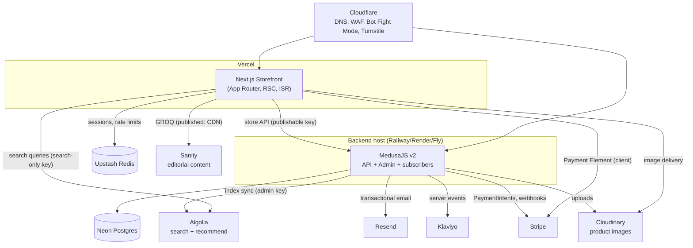

# System Architecture

## Component diagram

Two deployable applications; everything else is SaaS:

- **Storefront** (`apps/storefront`): Next.js App Router on Vercel. Talks to Medusa's Store API with the publishable key, Algolia with the search-only key, Sanity's CDN. Server actions handle anything needing a server secret (Turnstile verification, Upstash, Klaviyo list adds).
- **Backend** (`apps/medusa`): Medusa v2 on a long-running Node host. Owns Postgres, receives all webhooks, runs subscribers that fan events out (see [integration-map](integration-map.md)). The admin dashboard ships with it at `/app`.

## Rendering strategy per route

The rule: **catalog and content are static with revalidation; anything money- or identity-bearing is dynamic.**

| Route(s) | Strategy | Revalidate |
|---|---|---|
| `/` home | ISR | 1h + on-demand (Sanity webhook) |
| `/fragrances/[category]` PLP | ISR shell; filters/sort client-side via Algolia | 1h + on-demand (product events) |
| `/brands`, `/brands/[slug]` | ISR | 24h / 1h |
| `/products/[handle]` PDP | ISR | on-demand via Medusa `product.updated`; price/stock re-checked client-side on mount |
| `/search` | Dynamic shell + client InstantSearch | n/a |
| `/guides/*`, `/policies/*` | ISR | on-demand (Sanity webhook) |
| `/cart`, `/checkout` | Dynamic (SSR + client) | never cached |
| `/order/*`, `/account/*`, auth pages | Dynamic, `noindex` | never cached |

On-demand revalidation flows through one route handler, `POST /api/revalidate` (secret-protected), called by both Sanity webhooks and a Medusa subscriber; it maps payload → `revalidateTag('product:{handle}')` etc. Tag every `fetch` to Medusa/Sanity with granular cache tags from day one.

## Request flows worth pinning down

**Add to cart (guest)**
1. Client calls a server action → reads `_oe_session` cookie (creates if absent).
2. Action looks up `cart:{sessionId}` in Upstash → gets/creates a Medusa cart → `POST /store/carts/{id}/line-items`.
3. Returns the updated cart; client updates the header badge optimistically first, reconciles after.

**Checkout payment (Stripe)**
1. `/checkout` creates/refreshes a Medusa payment session → Medusa creates a Stripe PaymentIntent → client mounts Payment Element with the client secret.
2. On confirm, Stripe processes; client polls/awaits Medusa cart completion.
3. `payment_intent.succeeded` webhook → Medusa completes the cart → order created → subscribers fire (email, Klaviyo, analytics CAPI). Order creation is **webhook-driven, not client-driven** — the client redirect is only UX.

**Product update propagation**
Medusa admin edit → `product.updated` event → subscribers: (a) upsert Algolia record, (b) call storefront revalidate for `product:{handle}` and its category/brand tags.

## Environments

| Env | Storefront | Backend | DB | Keys |
|---|---|---|---|---|
| local | localhost:3000 | localhost:9000 | Docker Postgres | test |
| preview | Vercel preview URL per PR | shared staging backend | Neon `preview` branch | test |
| production | odorelite.com | api.odorelite.com | Neon `main` | live |

## Failure-mode policies

- **Algolia down**: search page shows a degraded Medusa-backed product list (`/store/products?q=`); PLPs already render from Medusa, only faceting is lost.
- **Sanity down**: ISR keeps serving the last rendered page; only new publishes stall.
- **Stripe webhook delayed**: order-confirmation page handles the "payment processing" intermediate state ([10-order-confirmation TRD](../03-pages/10-order-confirmation.md)); never show an error for a succeeded charge.
- **Redis down**: guest carts degrade to cookie-scoped Medusa cart id (fallback cookie holds the cart id directly); rate limiting fails open at the app layer (Cloudflare edge limits still apply).
