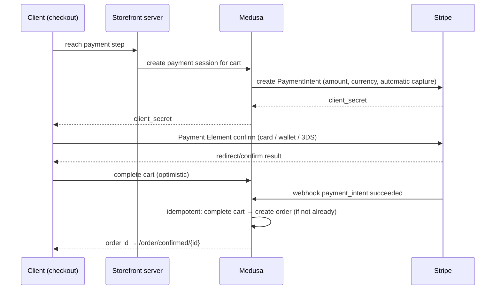

# Payments & Compliance

Payment flows end-to-end, the idempotency rules that keep money and orders consistent, and the privacy/legal obligations. Gateway setup: [Stripe](../01-prerequisites/04-stripe.md), [Razorpay addendum](../01-prerequisites/05-razorpay-addendum.md). PCI scope: [security doc](security-and-bots.md).

## Payment flow (Stripe primary)

Key decisions:

- **Automatic capture** (no auth-hold window) — fragrances ship fast.
- **Webhook is the source of truth** for order creation. The client "complete cart" call is an optimization; if it races or fails, the webhook path still creates the order, and the confirmation page tolerates a processing state ([TRD 10](../03-pages/10-order-confirmation.md)).
- Cart totals are recomputed server-side by Medusa at payment-session creation; the client can never set amounts.
- Currency/region: single region (USD) until open decision #2 resolves; Razorpay flow differences are listed in the [addendum](../01-prerequisites/05-razorpay-addendum.md).

## Idempotency rules

| Point | Rule |
|---|---|
| Stripe webhook | dedupe on `event.id` (Redis SETNX 24h / dedupe table) before any processing |
| Cart completion | Medusa cart completion is idempotent — completing an already-completed cart returns the existing order, never a duplicate |
| PaymentIntent creation | reuse the cart's existing intent on re-entry to checkout (amount updated), never create a second intent per cart |
| Outbound side effects | each subscriber action keyed on `(order_id, action)` — one confirmation email per order no matter how often events replay |
| Refunds | issued only from Medusa admin (which calls Stripe), so store and gateway never disagree |

## Failure & dispute handling

- `payment_intent.payment_failed` → cart stays open; checkout shows the gateway's decline message verbatim category ("card declined") without inventing detail.
- Chargebacks: Stripe Radar reviews > $500 orders; on dispute, respond with fulfillment/tracking evidence from the order record. Track dispute rate < 0.5%.
- Partial refunds supported via Medusa admin (returns of one item from a multi-item order).

## Taxes

Phase 1: Medusa's flat tax-rate per region (single US rate or 0 + "tax included" pricing). Revisit with Stripe Tax when nexus/jurisdictions become real — flagged as a launch-checklist item in the [roadmap](../05-roadmap.md).

## Privacy: GDPR / CCPA posture

| Obligation | Implementation |
|---|---|
| Consent for non-essential cookies | Consent banner (CMP) gates GA4/Meta/PostHog/Klaviyo scripts; strictly-necessary (cart session) exempt. Consent state stored 12mo; region-aware (opt-in EU, opt-out CCPA notice) |
| Lawful basis for marketing | explicit opt-in only ([email-flows](email-flows.md)); records kept in Klaviyo |
| Right to access/delete | support-driven initially: documented runbook — export/delete customer from Medusa, Klaviyo, Stripe (redact, don't delete financial records), PostHog; 30-day SLA |
| Data minimization | no card data stored (PCI SAQ A); guest orders keep email + address only; analytics params never contain email/PII ([tracking plan](../02-architecture/analytics-tracking-plan.md)) |
| Processors list | Stripe, Vercel, Neon, Algolia, Resend, Klaviyo, Sanity, Cloudinary, Upstash, Cloudflare, Google, Meta, PostHog, Sentry — enumerated in the privacy policy |

## Legal pages (Sanity `policyPage`, rendered per [TRD 07](../03-pages/07-content-pages.md))

- `/policies/privacy` — includes processor list, cookie table, rights process.
- `/policies/terms` — sale terms, age statement, jurisdiction.
- `/policies/shipping` — zones, carriers, times, **hazmat note: fragrances are flammable liquids; some carriers/regions restrict air shipping — ground-only where applicable**.
- `/policies/returns` — window, opened-product policy (industry standard: unopened only), refund timelines.

Footer links all four on every page; checkout links terms + privacy adjacent to the pay button ("By placing this order you agree…").

## Acceptance

- Duplicate-delivery test: replaying a `payment_intent.succeeded` webhook creates no second order and no second email.
- Kill the client after Stripe confirm but before redirect → order still appears (webhook path) and confirmation email still sends.
- With consent declined, no GA4/Meta/PostHog network requests fire; cart still works.
- All four policy pages published and linked before launch.
