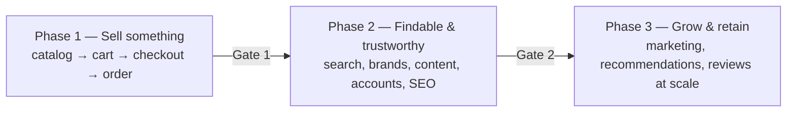

# Roadmap

Three phases, each with an acceptance gate that must fully pass before the next phase starts. Doc references are the specs to build against; the [accounts checklist](01-prerequisites/00-accounts-checklist.md) lists which services to set up per phase.

## Phase 1 — Sell something (MVP)

**Goal: a guest can find a product, pay, and receive a confirmation email on the production domain.**

| Work | Spec |
|---|---|
| Accounts: GitHub/Vercel, Neon, Stripe, Resend, Cloudinary, Upstash + local setup | [checklist Phase 1](01-prerequisites/00-accounts-checklist.md), docs 01–04, 08, 11, 13 |
| Scaffold monorepo (Medusa + Next.js starter), environments, CI | [01-local-dev-setup](01-prerequisites/01-local-dev-setup.md), [02-github-vercel](01-prerequisites/02-github-vercel.md) |
| Data model extensions: brand, note, family modules + seed catalog | [data-model](02-architecture/data-model.md) |
| Stripe webhooks + order subscribers (confirmation email T1/T2) | [integration-map](02-architecture/integration-map.md), [payments-and-compliance](04-cross-cutting/payments-and-compliance.md), [email-flows](04-cross-cutting/email-flows.md) T1–T5 |
| Pages: Home (minimal — hero, category tiles, trending), Category PLP (Medusa-backed initially, Algolia lands in P2), PDP (no reviews yet), Cart, Checkout (guest, Stripe), Order confirmation, Order status + guest tokens | TRDs [01](03-pages/01-home.md), [02](03-pages/02-category-plp.md), [06](03-pages/06-product-detail.md), [08](03-pages/08-cart.md), [09](03-pages/09-checkout.md), [10](03-pages/10-order-confirmation.md), [11](03-pages/11-order-status-tracking.md) |
| Policy pages (static markdown initially; Sanity in P2) | [payments-and-compliance](04-cross-cutting/payments-and-compliance.md) legal section |
| Baseline SEO: URL scheme, metadata, robots, product sitemap | [seo-requirements](04-cross-cutting/seo-requirements.md) |

**Gate 1 — pass all of:**
- [ ] End-to-end guest purchase on production with a real card (then refunded) incl. T1 email and working guest status link.
- [ ] Stripe test matrix (success/decline/3DS) green in staging; webhook-replay produces no duplicate orders.
- [ ] All four policy pages live; checkout links them.
- [ ] Core Web Vitals green on PDP/PLP (Lighthouse mobile ≥ 90 performance).

## Phase 2 — Findable & trustworthy

**Goal: shoppers can search, browse brands, read content, and hold accounts; the store earns organic traffic.**

| Work | Spec |
|---|---|
| Accounts: Algolia, Sanity, Cloudflare, GA4/Search Console, Sentry | [checklist Phase 2](01-prerequisites/00-accounts-checklist.md), docs 06, 07, 10, 12 |
| Algolia sync + search page + autocomplete + PLP faceting migration | [search-and-recommendations](04-cross-cutting/search-and-recommendations.md), TRDs [02](03-pages/02-category-plp.md), [05](03-pages/05-search-results.md) |
| Brand index + brand pages | TRDs [03](03-pages/03-brand-index.md), [04](03-pages/04-brand-page.md) |
| Sanity content: guides, blog, policies migration, homepage editorial | [10-sanity](01-prerequisites/10-sanity.md), TRD [07](03-pages/07-content-pages.md), full TRD [01](03-pages/01-home.md) |
| Auth + account area: sign in/up/reset, overview, order history, addresses, saved cards | TRDs [12](03-pages/12-sign-in.md)–[18](03-pages/18-addresses.md) |
| Wishlist (guest + merge) | TRD [19](03-pages/19-wishlist.md) |
| Reviews (submit, moderate, display, JSON-LD) | TRD [06](03-pages/06-product-detail.md), [data-model](02-architecture/data-model.md) |
| Security hardening: Turnstile, rate limits, headers, Cloudflare WAF | [security-and-bots](04-cross-cutting/security-and-bots.md) |
| Analytics: GA4 + Sentry live, tracking plan implemented, consent banner | [analytics-tracking-plan](02-architecture/analytics-tracking-plan.md), [12-analytics](01-prerequisites/12-analytics.md), [compliance](04-cross-cutting/payments-and-compliance.md) |

**Gate 2 — pass all of:**
- [ ] Typo/synonym search queries return correct results; zero-results rate < 5% over a test week.
- [ ] Full account lifecycle green: signup → merge (cart+wishlist) → order → history → saved card reuse → password reset.
- [ ] Auth endpoints rate-limited and Turnstile-gated (scripted attack test blocked).
- [ ] GA4 funnel (`view_item` → `purchase`) records an end-to-end session; consent-declined session fires no trackers.
- [ ] Rich results (Product, Article, Brand, Breadcrumb) validate; sitemap submitted in Search Console.

## Phase 3 — Grow & retain

**Goal: the store markets itself — flows, recommendations, and retention loops running.**

| Work | Spec |
|---|---|
| Accounts: Klaviyo, Meta Pixel/CAPI, PostHog (+ Razorpay if decision #1 says India) | [checklist Phase 3](01-prerequisites/00-accounts-checklist.md), docs 05, 09, 12 |
| Klaviyo flows M1–M5 + newsletter capture | [email-flows](04-cross-cutting/email-flows.md) |
| Algolia Recommend rails (PDP, cart, confirmation, home) once trained; back-in-stock T9 | [search-and-recommendations](04-cross-cutting/search-and-recommendations.md) |
| Meta CAPI dedup, PostHog funnels + replay | [analytics-tracking-plan](02-architecture/analytics-tracking-plan.md) |
| SEO long-tail: note/family landing pages, guide program cadence | [seo-requirements](04-cross-cutting/seo-requirements.md) |
| Nice-to-haves as data justifies: invoice PDFs, wishlist sharing, price-drop alerts, samples/decant program | flagged in TRDs [16](03-pages/16-order-history.md), [19](03-pages/19-wishlist.md) |

**Gate 3 (steady-state health, reviewed monthly):**
- [ ] Abandoned-cart flow recovering ≥ 5% of abandoned carts.
- [ ] Recommend rails outperforming fallback logic on CTR (A/B via PostHog flags).
- [ ] Meta client/server events deduplicating at ≥ 95% match quality.
- [ ] WISMO tickets < 2 per 100 orders; dispute rate < 0.5%.

## Standing decisions to revisit

1. **Open decision #1 (market/gateway)** — decide before Phase 1 checkout build; Razorpay work lands in Phase 3 otherwise.
2. Taxes: revisit Stripe Tax at Phase 2 exit ([payments doc](04-cross-cutting/payments-and-compliance.md)).
3. Multi-currency/regions: only after decision #1.
