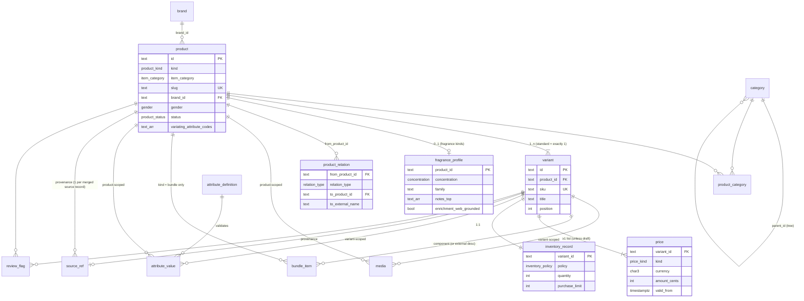

# Entity-Relationship Diagram

Cardinality legend: `||` exactly one · `o|` zero or one · `|{` one or more · `o{` zero or more.

## Reading the shape

- **Commerce spine**: `brand → product → variant → price / inventory_record`. Everything buyable is a variant; everything browsable is a product.
- **Variation is declared, not implied**: `attribute_definition` (registry) → `attribute_value` (values). A master's `variating_attribute_codes` says which attribute tuples distinguish its variants.
- **The fragrance vertical is a typed satellite**: `fragrance_profile` hangs 1:0..1 off product; facetable fields are mirrored into `attribute_value` at emit.
- **Graph layer**: `product_relation` links products to each other and to external fragrance names (`dupe_of` targets, `similar` references).
- **Operational layer**: `source_ref` (provenance/idempotency) and `review_flag` (quality queues) — no storefront reads, pipeline reads/writes.
