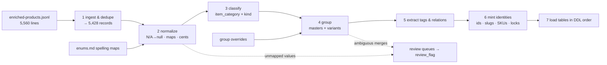

# How to Form the Schema from the Source Data

The end-to-end recipe: from `enriched-products.jsonl` to populated canonical tables. Each step is a future pipeline stage; every step is deterministic and idempotent so re-runs never change published identities.

## 1. Ingest & dedupe

Group lines by `source.id`. For duplicate ids (132 retry lines `[verified]`) keep the line with non-empty enrichment (latest wins on ties); drop the 126 stale empty-enrichment lines. Record every dropped line id in the ingest report. **Gate: exactly 5,428 records remain.** Hash each kept raw line (SHA-256) for `source_ref.raw_hash`.

## 2. Normalize

- Deep-walk every record: `"N/A"` → `null` (arrays → `[]`). **Gate: zero "N/A" strings downstream.**
- Apply the spelling maps from [`enums.md`](./enums.md) for gender, concentration, product type. Unknown values are **never guessed** — they go to the unmapped-values queue (`review_flag.flag_type = unmapped_value`) and the record proceeds with null.
- Accent-fold + alias-cluster vendors → brand rows (display name keeps accents).
- Strip size / gender / concentration tokens that bleed into product names (`"Good Girl by Carolina Herrera 2.7 oz EDP for Women"` → `"Good Girl"`); keep the original in `source_ref.title_raw`. Parse size into ml and oz.
- Prices: decimal strings → integer cents by string math (no float parse). `perfumer` string → array.

## 3. Classify

Regex ladder over `product_type` + cleaned title, most-specific first: gift set → `kind=bundle`, `item_category=gift_set` · tester markers → tester flag (variant attribute, decision 3) · miniature/travel → `miniature` · body spray/mist → `body_spray` · candle/home → `candle` (draft) · skin & beauty → `skin_beauty` (draft) · zero-price "Pickup Instore" rows (10 `[verified]`) → `kind=service`, draft, `placeholder_price` flag · default → `fragrance`, `kind` decided by grouping (standard vs variant_master). Expected class counts ≈ 21 gift sets, 31 candles, 155 skin & beauty `[confirm-locally]`.

## 4. Group into masters + variants

The source has one product per size `[verified]`; masters are derived by this ladder, in order:

1. **Exact key**: (brand_folded, name_folded, concentration, gender) — merges the ~341 implicit size-sibling groups (738 records `[verified]`).
2. **YGroup tags**: emit `same_line` relations only — never merge (groups mix concentrations and genders `[verified]`).
3. **Fuzzy**: token-set similarity on folded names within the same (brand, concentration, gender): ≥ 0.90 merge; 0.80–0.90 → grouping review queue (`grouping_ambiguous` flags with candidate + score); < 0.80 separate.
4. **Overrides**: apply the hand-curated override map (answers from the review queue) last — it wins over every rule above.

Then: testers attach as variants to their parent master (`is_tester = true`, decision 3); EDP vs Parfum of one name stay separate products with `same_line` (decision 2). **Gate: 4,400–4,900 products; grouping queue < 150.**

## 5. Extract tags & relations

`DUPE` → `is_clone` + `dupe_of` relation (target fuzzy-resolved into catalog ≥ 0.90, else `to_external_name`) · `LIMITn` → `purchase_limit` · price-band tags → cross-check against actual list price, mismatch flags, never stored · `similar_fragrances` → `similar` relations (same resolve rule) · name analysis → `flanker_of` · residual tags → `product.tags`.

## 6. Mint identities (and lock them)

- Product id: `prod_` + hash(brand_folded, name_folded, concentration, gender). Slug: `{brand-slug}-{name-slug}`, concentration suffix only to disambiguate split masters, collision appends `-2`.
- SKU: `OE-{BRAND4}-{NAME6}-{SIZEML}{CONC2}` + `-T` tester / `-R` refill, collision `-2` (CONC2 codes in [`tables/variant.md`](./tables/variant.md)).
- First emit writes a **lock file** (natural key → id/slug/sku). Every later run reads locks first: published identities never change, even if normalization improves. New records mint fresh; conflicts with locked values shift the *new* record's identity, never the locked one.

## 7. Load in DDL order

`brand` → `category` → `attribute_definition` (static seed) → `product` → `product_category` → `variant` → `attribute_value` → `price` → `inventory_record` → `media` → `fragrance_profile` → `product_relation` → `bundle_item` → `source_ref` → `review_flag`. Reference DDL: [`ddl/schema.sql`](./ddl/schema.sql).

## 8. Reconcile

Print and check the reconciliation table every run — unexplained deltas fail the run:

| Stage | Expected |
|---|---|
| Raw lines | 5,560 |
| After dedupe | 5,428 (dropped exactly 132 + 126) |
| Products after grouping | 4,400–4,900 |
| Active vs draft | active = fragrance/tester/gift_set/miniature/body_spray; draft = candle + skin_beauty + services `[confirm-locally: counts]` |
| Variants | = deduped records that grouped (≥ product count) |
| Open flags | missing_image 135 · placeholder_price 10 · needs_re_enrichment ≈ 4,092 |

## 9. Work the review queues

1. **Unmapped values** → extend the maps in `enums.md`, re-run. Gate: zero unmapped.
2. **Grouping queue** → human accept/reject per candidate pair → override map; re-run.
3. **Re-enrichment queue** (grounded=false, prioritized: missing brand/name → null perfumer/launch_year/notes on in-stock items) → feed back through the scraper's Gemini agent with web grounding on → re-import updates `fragrance_profile` + provenance, resolves flags.
4. **Missing images** → brand-logo placeholder as interim `main`; source real imagery over time.
